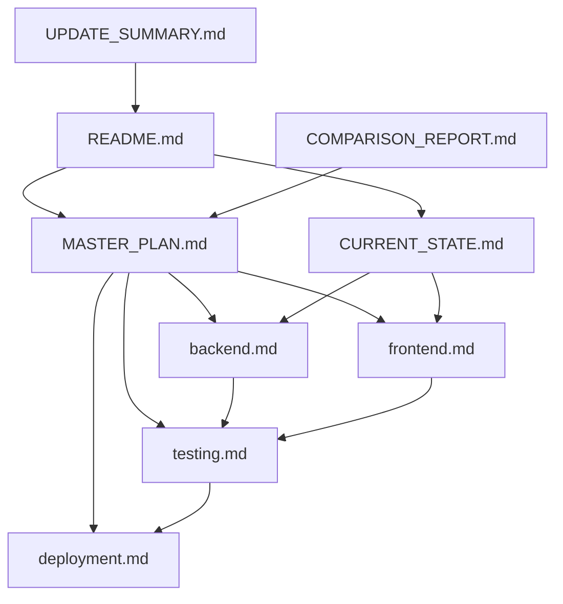

# 📚 Índice Completo - Documentación Generación de Cuotas Anuales

**Mapa de Navegación de la Documentación**

---

## 🗺️ Mapa Visual

```
📁 docs/annual_fee_generation/
│
├── 📄 README.md                    ⭐ INICIO - Landing Page
│   └─ Guías rápidas por rol
│   └─ Enlaces a todos los documentos
│
├── 📄 MASTER_PLAN.md               🎯 DOCUMENTO PRINCIPAL
│   ├─ Resumen Ejecutivo
│   ├─ Estado Actual (gaps)
│   ├─ Arquitectura y Decisiones
│   ├─ Roadmap (25 días, 5 sprints)
│   ├─ Riesgos y Mitigaciones
│   ├─ Criterios de Aceptación
│   └─ Guía de Uso por Rol
│
├── 📄 CURRENT_STATE.md             📊 ANÁLISIS DE CÓDIGO
│   ├─ ✅ Lo que YA existe (40%)
│   ├─ ❌ Lo que FALTA (60%)
│   ├─ Tabla comparativa completa
│   ├─ Gaps críticos identificados
│   └─ Plan de implementación priorizado
│
├── 📄 backend.md                   🔧 GUÍA BACKEND
│   ├─ Arquitectura Clean Architecture
│   ├─ Paso 1: Modelo de Datos
│   ├─ Paso 2: Migraciones SQL
│   ├─ Paso 3: Repositorio GORM
│   ├─ Paso 4: Servicio de Dominio
│   ├─ Paso 5: GraphQL API
│   ├─ Paso 6: Tests Unitarios
│   └─ Checklist de implementación
│
├── 📄 frontend.md                  💻 GUÍA FRONTEND
│   ├─ Setup GraphQL + Codegen
│   ├─ API Layer (queries, mutations)
│   ├─ Custom Hooks (React Query)
│   ├─ Componentes UI (React + TS)
│   ├─ Páginas y Rutas
│   ├─ i18n (es, fr, wo)
│   ├─ Validaciones Client-Side
│   └─ Tests de Componentes
│
├── 📄 testing.md                   🧪 ESTRATEGIA DE TESTING
│   ├─ Pirámide de Testing (70/25/5)
│   ├─ Tests Unitarios Backend (Go)
│   ├─ Tests Integración Backend
│   ├─ Tests Unitarios Frontend (Jest)
│   ├─ Tests Componentes (RTL)
│   ├─ Tests E2E (Cypress)
│   └─ Métricas de Cobertura
│
├── 📄 deployment.md                🚀 GUÍA DE DESPLIEGUE
│   ├─ Estrategia Blue-Green
│   ├─ Pipeline CI/CD (GitHub Actions)
│   ├─ Smoke Tests Automatizados
│   ├─ Rollback Procedures
│   ├─ Monitoring (Prometheus, Grafana)
│   └─ Incident Response
│
├── 📄 COMPARISON_REPORT.md         📋 ANÁLISIS DE DIFERENCIAS
│   ├─ Comparación backend vs frontend docs
│   ├─ Problemas críticos detectados
│   ├─ Decisiones tomadas
│   └─ Plan de sincronización
│
├── 📄 UPDATE_SUMMARY.md            📝 RESUMEN DE ACTUALIZACIONES
│   ├─ Cambios realizados
│   ├─ Documentos nuevos vs actualizados
│   ├─ Métricas de mejora
│   └─ Checklist de completitud
│
└── 📄 INDEX.md                     📚 ESTE DOCUMENTO
    └─ Mapa navegable completo
```

---

## 🎯 Documentos por Objetivo

### 1. Quiero Empezar (Onboarding)

```
1. README.md              ← Empieza aquí
2. MASTER_PLAN.md         ← Lee completo (30-45 min)
3. CURRENT_STATE.md       ← Entiende el código actual (15 min)
4. backend.md O frontend.md  ← Según tu rol (60 min)
```

**Tiempo total**: ~2 horas

---

### 2. Quiero Implementar Backend

```
1. MASTER_PLAN.md              ← Arquitectura + Decisiones
   └─ Sección: "Estado Actual"
   └─ Sección: "Arquitectura"
   
2. CURRENT_STATE.md            ← Gaps específicos backend
   └─ Busca: "❌ Backend"
   
3. backend.md                  ← Implementación paso a paso
   └─ Paso 1: Modelo
   └─ Paso 2: Migraciones
   └─ Paso 3: Repositorio
   └─ Paso 4: Servicio
   └─ Paso 5: GraphQL
   └─ Paso 6: Tests
   
4. testing.md                  ← Tests unitarios + integración
   └─ Sección: "Tests Unitarios Backend"
```

**Duración estimada**: 15 días

---

### 3. Quiero Implementar Frontend

```
1. MASTER_PLAN.md              ← Arquitectura + Hooks pattern
   └─ Sección: "Decisión 4: Frontend"
   
2. frontend.md                 ← Implementación completa
   └─ Paso 1: GraphQL Operations
   └─ Paso 2: API Layer
   └─ Paso 3: Custom Hooks
   └─ Paso 4: Componentes
   └─ Paso 5: Páginas
   └─ Paso 6: i18n
   
3. testing.md                  ← Tests componentes + hooks
   └─ Sección: "Tests Frontend"
```

**Duración estimada**: 15 días (tras backend en staging)

---

### 4. Quiero Hacer QA

```
1. MASTER_PLAN.md              ← Criterios de aceptación
   └─ Sección: "Criterios de Aceptación"
   
2. testing.md                  ← Estrategia completa
   └─ Tests unitarios
   └─ Tests integración
   └─ Tests E2E
   
3. deployment.md               ← Smoke tests
   └─ Sección: "Smoke Tests"
```

**Duración estimada**: 10 días

---

### 5. Quiero Desplegar

```
1. deployment.md               ← Blue-Green + Rollback
   └─ Pre-deploy checklist
   └─ Deploy procedure
   └─ Smoke tests
   └─ Rollback procedure
   
2. MASTER_PLAN.md              ← Riesgos
   └─ Sección: "Riesgos y Mitigaciones"
   
3. backend.md                  ← Validar migraciones
   └─ Sección: "Migraciones"
```

**Duración estimada**: 5 días

---

### 6. Quiero Entender Decisiones Técnicas

```
1. MASTER_PLAN.md              ← Todas las decisiones justificadas
   └─ Sección: "Arquitectura y Decisiones Técnicas"
   └─ Decisión 1: Modelo de Datos
   └─ Decisión 2: Lógica de Generación
   └─ Decisión 3: Prevención de Duplicados
   └─ Decisión 4: Frontend Hooks
   └─ Decisión 5: Testing Strategy
   
2. COMPARISON_REPORT.md        ← Por qué se tomaron ciertas decisiones
```

---

## 📊 Documentos por Nivel de Detalle

### 🔴 Nivel Ejecutivo (Tech Lead / PM)

| Documento | Tiempo Lectura | Información Clave |
|-----------|----------------|-------------------|
| README.md | 5 min | Overview y Quick Start |
| MASTER_PLAN.md | 30 min | Roadmap, Riesgos, Métricas |
| COMPARISON_REPORT.md | 10 min | Decisiones tomadas |

**Total**: 45 minutos

---

### 🟡 Nivel Técnico (Developers)

| Documento | Tiempo Lectura | Información Clave |
|-----------|----------------|-------------------|
| README.md | 5 min | Quick Start |
| MASTER_PLAN.md | 45 min | Arquitectura completa |
| CURRENT_STATE.md | 15 min | Gaps a implementar |
| backend.md O frontend.md | 60 min | Guía implementación |
| testing.md | 30 min | Tests a escribir |

**Total**: ~3 horas

---

### 🟢 Nivel Operacional (DevOps / QA)

| Documento | Tiempo Lectura | Información Clave |
|-----------|----------------|-------------------|
| README.md | 5 min | Overview |
| MASTER_PLAN.md | 30 min | Riesgos y criterios |
| deployment.md | 45 min | Procedimientos completos |
| testing.md | 30 min | Estrategia de testing |

**Total**: ~2 horas

---

## 🔍 Búsqueda Rápida por Tema

### Arquitectura
- **MASTER_PLAN.md** → Sección "Arquitectura y Decisiones Técnicas"
- **backend.md** → Sección "Arquitectura"
- **COMPARISON_REPORT.md** → "Análisis de Arquitectura"

### Modelo de Datos
- **MASTER_PLAN.md** → "Decisión 1: Modelo de Datos"
- **backend.md** → "Paso 1: Modelo de Datos"
- **CURRENT_STATE.md** → "Modelo Payment vs MemberFeeAssignment"

### Migraciones SQL
- **backend.md** → "Paso 2: Migraciones"
- **MASTER_PLAN.md** → "Sprint 1: Migraciones"

### GraphQL
- **backend.md** → "Paso 5: GraphQL"
- **frontend.md** → "Paso 1: GraphQL Operations"
- **MASTER_PLAN.md** → "Sprint 2: Backend GraphQL"

### Prevención de Duplicados
- **MASTER_PLAN.md** → "Decisión 3: Prevención de Duplicados"
- **backend.md** → "Lógica de Generación"

### Tests
- **testing.md** → Todo el documento
- **MASTER_PLAN.md** → "Decisión 5: Testing Strategy"
- **backend.md** → "Paso 6: Tests"
- **frontend.md** → Sección "Tests"

### Despliegue
- **deployment.md** → Todo el documento
- **MASTER_PLAN.md** → "Sprint 5: QA y Deploy"

### Riesgos
- **MASTER_PLAN.md** → Sección "Riesgos y Mitigaciones"

### Cronograma
- **MASTER_PLAN.md** → Sección "Roadmap" y "Estimaciones"
- **README.md** → "Roadmap Resumido"

---

## 📁 Estructura por Rol

### Backend Developer

```
Tu Documentación:
├── MASTER_PLAN.md (Arquitectura + Roadmap)
├── CURRENT_STATE.md (Gaps backend)
├── backend.md (Implementación paso a paso)
└── testing.md (Tests unitarios)

Referencia Ocasional:
├── deployment.md (Migraciones)
└── COMPARISON_REPORT.md (Decisiones)

No Necesitas:
└── frontend.md (Es para frontend team)
```

---

### Frontend Developer

```
Tu Documentación:
├── MASTER_PLAN.md (Arquitectura + Hooks)
├── frontend.md (Implementación completa)
└── testing.md (Tests componentes)

Referencia Ocasional:
├── backend.md (Entender API)
└── CURRENT_STATE.md (Contexto)

No Necesitas:
└── deployment.md (Es para DevOps)
```

---

### QA Engineer

```
Tu Documentación:
├── MASTER_PLAN.md (Criterios de aceptación)
├── testing.md (Estrategia completa)
└── deployment.md (Smoke tests)

Referencia Ocasional:
├── backend.md (Entender lógica)
└── frontend.md (Entender UI)

No Necesitas:
└── COMPARISON_REPORT.md
```

---

### DevOps / SRE

```
Tu Documentación:
├── deployment.md (Blue-Green, Rollback)
├── MASTER_PLAN.md (Riesgos)
└── backend.md (Migraciones)

Referencia Ocasional:
├── testing.md (Smoke tests)
└── CURRENT_STATE.md (Dependencias)

No Necesitas:
└── frontend.md
```

---

## 🎓 Rutas de Aprendizaje

### Ruta 1: "Necesito Contexto General" (30 min)

1. **README.md** (5 min)
   - ¿Qué es el proyecto?
   - ¿Por qué es importante?
   
2. **MASTER_PLAN.md - Resumen Ejecutivo** (10 min)
   - Objetivo
   - Alcance
   - Prioridad
   
3. **CURRENT_STATE.md** (15 min)
   - Estado actual
   - Qué falta

---

### Ruta 2: "Voy a Implementar Backend" (3 horas)

1. **README.md** (5 min)
2. **MASTER_PLAN.md - Arquitectura** (45 min)
3. **CURRENT_STATE.md - Backend Gaps** (15 min)
4. **backend.md - Pasos 1-3** (60 min)
5. **testing.md - Tests Backend** (30 min)
6. **backend.md - Pasos 4-6** (60 min)

---

### Ruta 3: "Voy a Implementar Frontend" (3 horas)

1. **README.md** (5 min)
2. **MASTER_PLAN.md - Decisión 4** (20 min)
3. **frontend.md - Setup** (30 min)
4. **frontend.md - Hooks** (45 min)
5. **frontend.md - Componentes** (60 min)
6. **testing.md - Tests Frontend** (30 min)

---

### Ruta 4: "Voy a Hacer QA" (2 horas)

1. **README.md** (5 min)
2. **MASTER_PLAN.md - Criterios** (30 min)
3. **testing.md** (60 min)
4. **deployment.md - Smoke Tests** (20 min)

---

### Ruta 5: "Voy a Desplegar" (1.5 horas)

1. **deployment.md** (45 min)
2. **MASTER_PLAN.md - Riesgos** (20 min)
3. **backend.md - Migraciones** (15 min)
4. **testing.md - Smoke Tests** (10 min)

---

## 🔗 Dependencias entre Documentos



---

## ✅ Checklist de Uso

### Para Nuevos Miembros del Equipo

- [ ] He leído README.md
- [ ] He leído MASTER_PLAN.md completo
- [ ] He revisado CURRENT_STATE.md
- [ ] He identificado mi documentación según mi rol
- [ ] He leído la guía técnica de mi rol (backend.md o frontend.md)
- [ ] Entiendo el cronograma y mi parte
- [ ] Conozco los criterios de aceptación de mi trabajo

---

### Para Implementación

- [ ] He creado mi rama de feature
- [ ] Tengo acceso a la documentación offline
- [ ] He marcado en la guía técnica qué pasos he completado
- [ ] Estoy escribiendo tests conforme a testing.md
- [ ] Estoy documentando decisiones técnicas importantes
- [ ] He revisado MASTER_PLAN.md para riesgos de mi área

---

### Para Code Review

- [ ] El código sigue las guías de backend.md o frontend.md
- [ ] Los tests cumplen testing.md
- [ ] No hay duplicados de funcionalidad existente (ver CURRENT_STATE.md)
- [ ] Las decisiones técnicas siguen MASTER_PLAN.md
- [ ] La implementación cumple criterios de aceptación

---

## 📞 FAQ sobre la Documentación

### P: ¿Qué documento leo primero?
**R**: Siempre empieza con [README.md](./README.md), luego [MASTER_PLAN.md](./MASTER_PLAN.md)

### P: ¿Está actualizada la documentación?
**R**: Sí, última actualización: **2025-11-07**. Ver [UPDATE_SUMMARY.md](./UPDATE_SUMMARY.md)

### P: ¿Puedo modificar esta documentación?
**R**: Sí, pero:
1. Discútelo primero con el equipo
2. Actualiza el changelog en el documento modificado
3. Actualiza INDEX.md si cambias la estructura

### P: ¿Qué hago si encuentro inconsistencias?
**R**: 
1. Revisa [COMPARISON_REPORT.md](./COMPARISON_REPORT.md)
2. Si persiste, reporta al Tech Lead
3. El MASTER_PLAN.md siempre tiene prioridad

### P: ¿Cuánto tiempo debo invertir en leer antes de codificar?
**R**: 
- Mínimo: 2 horas (README + MASTER_PLAN + tu guía técnica)
- Recomendado: 4 horas (incluye CURRENT_STATE + testing.md)

### P: ¿Necesito leer toda la documentación?
**R**: No. Usa la sección "Documentos por Rol" de este índice.

---

## 🎯 Próximos Pasos

Ahora que conoces la estructura completa:

1. **Si eres nuevo**: Lee [README.md](./README.md) → [MASTER_PLAN.md](./MASTER_PLAN.md)

2. **Si vas a codificar**: Ve a tu guía técnica:
   - Backend: [backend.md](./backend.md)
   - Frontend: [frontend.md](./frontend.md)

3. **Si vas a testear**: Lee [testing.md](./testing.md)

4. **Si vas a desplegar**: Lee [deployment.md](./deployment.md)

5. **Si tienes dudas**: Consulta [COMPARISON_REPORT.md](./COMPARISON_REPORT.md)

---

## 📊 Métricas de la Documentación

| Métrica | Valor |
|---------|-------|
| Documentos Totales | 8 |
| Documentos Principales | 3 (README, MASTER_PLAN, CURRENT_STATE) |
| Guías Técnicas | 2 (backend, frontend) |
| Documentos de Proceso | 2 (testing, deployment) |
| Documentos de Referencia | 2 (COMPARISON, UPDATE_SUMMARY) |
| Páginas Totales | ~100 |
| Tiempo Lectura Mínimo | 2 horas |
| Tiempo Lectura Completo | 6-8 horas |
| Última Actualización | 2025-11-07 |
| Versión | 3.0.0 |

---

## ✅ Conclusión

Este índice te permite:

✅ Navegar eficientemente la documentación  
✅ Encontrar rápidamente la información que necesitas  
✅ Evitar leer documentos irrelevantes para tu rol  
✅ Entender las dependencias entre documentos  
✅ Seguir rutas de aprendizaje estructuradas  

**Usa este documento como mapa cuando te sientas perdido.**

---

**Última Actualización**: 2025-11-07  
**Versión**: 3.0.0  
**Mantenido por**: Tech Team ASAM
