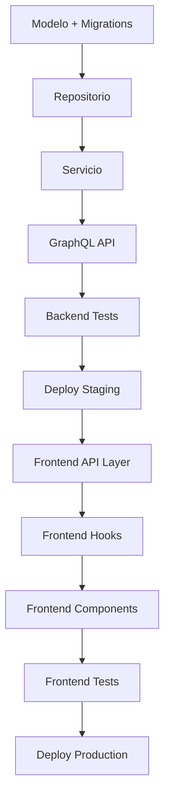

# 🎯 Plan Maestro - Generación de Cuotas Anuales ASAM

**Documento Consolidado Final**  
**Fecha**: 2025-11-07  
**Versión**: 3.0.0  
**Estado**: ✅ **LISTO PARA IMPLEMENTACIÓN**

---

## 📋 Índice Ejecutivo

1. [Resumen Ejecutivo](#-resumen-ejecutivo)
2. [Estado Actual del Proyecto](#-estado-actual-del-proyecto)
3. [Arquitectura y Decisiones Técnicas](#-arquitectura-y-decisiones-técnicas)
4. [Roadmap de Implementación](#-roadmap-de-implementación)
5. [Estimaciones y Cronograma](#-estimaciones-y-cronograma)
6. [Riesgos y Mitigaciones](#-riesgos-y-mitigaciones)
7. [Criterios de Aceptación](#-criterios-de-aceptación)
8. [Guía de Uso de la Documentación](#-guía-de-uso-de-la-documentación)

---

## 🎯 Resumen Ejecutivo

### Objetivo
Implementar un sistema completo de **generación de cuotas anuales** que permita a ASAM:
- ✅ Generar cuotas para el año actual y años pasados (migración histórica)
- ✅ Asignar automáticamente cuotas a miembros activos
- ✅ Vincular pagos con cuotas generadas
- ✅ Consultar estado de cuotas pendientes y pagadas
- ✅ Prevenir duplicados y garantizar integridad de datos

### Alcance
- **Backend**: API GraphQL completa con Clean Architecture
- **Frontend**: UI/UX completa con React, TypeScript, i18n
- **Testing**: Cobertura ≥85% con tests unitarios, integración y E2E
- **Deployment**: Estrategia Blue-Green con rollback automático

### Prioridad
🔴 **CRÍTICO** - Última funcionalidad necesaria para producción v1.0

---

## 📊 Estado Actual del Proyecto

### ✅ Lo Que YA Existe (No Duplicar)

#### Backend
```go
// ✅ YA EXISTE - NO CREAR
internal/domain/models/
├── payment.go              // Modelo completo con estados, montos, tipos
├── member.go              // Modelo con tipo de membresía
└── family.go              // Modelo de familias

internal/adapters/db/
├── payment_repository.go   // CRUD completo de pagos
├── member_repository.go    // Queries de miembros activos
└── family_repository.go    // Queries de familias

internal/adapters/gql/schema/
└── schema.graphql          // Types: Payment, Member, Family ya definidos
```

#### Frontend
```typescript
// ✅ YA EXISTE - NO CREAR
src/features/
├── members/               // CRUD completo de miembros
├── payments/             // Gestión de pagos existente
└── families/             // Gestión de familias

src/shared/
├── graphql/              // Setup Apollo Client
├── types/                // Tipos base TypeScript
└── i18n/                 // Sistema multiidioma (es, fr, wo)
```

### ❌ Lo Que FALTA (Implementar)

#### Backend - GAPs Identificados
```
❌ internal/domain/models/member_fee_assignment.go      [CRÍTICO]
❌ internal/ports/output/member_fee_assignment_repo.go  [CRÍTICO]
❌ internal/adapters/db/member_fee_assignment_repo.go   [CRÍTICO]
❌ internal/ports/input/membership_fee_service.go       [CRÍTICO]
❌ internal/domain/services/membership_fee_service.go   [CRÍTICO]
❌ internal/adapters/gql/resolvers/fee_resolver.go      [CRÍTICO]
❌ migrations/000XXX_create_member_fee_assignments.sql  [CRÍTICO]

⚠️ schema.graphql - Añadir types MemberFeeAssignment, etc [MEDIO]
```

#### Frontend - GAPs Identificados
```
❌ src/features/fees/                                   [CRÍTICO]
   ├── api/                                            [CRÍTICO]
   │   ├── queries.ts                                  
   │   ├── mutations.ts                                
   │   └── types.ts                                    
   ├── hooks/                                          [CRÍTICO]
   │   ├── useFeeGeneration.ts                         
   │   ├── useFeesList.ts                              
   │   └── usePendingFees.ts                           
   ├── components/                                     [CRÍTICO]
   │   ├── FeeGenerationDialog.tsx                     
   │   ├── FeeGenerationForm.tsx                       
   │   └── FeeListTable.tsx                            
   └── pages/                                          [CRÍTICO]
       └── AnnualFeesPage.tsx                          

❌ src/shared/graphql/operations/fees.graphql          [CRÍTICO]
❌ src/locales/{es,fr,wo}/fees.json                    [MEDIO]
```

### 📈 Análisis de Completitud

| Componente | Completitud | Estado | Esfuerzo |
|------------|-------------|--------|----------|
| Modelo de Datos | 40% | ⚠️ Parcial | 2 días |
| Backend Service | 0% | ❌ Falta | 3 días |
| Backend Repository | 0% | ❌ Falta | 2 días |
| GraphQL API | 30% | ⚠️ Parcial | 2 días |
| Frontend API Layer | 0% | ❌ Falta | 1 día |
| Frontend Hooks | 0% | ❌ Falta | 2 días |
| Frontend Components | 0% | ❌ Falta | 3 días |
| Tests Backend | 0% | ❌ Falta | 2 días |
| Tests Frontend | 0% | ❌ Falta | 2 días |
| Deployment | 80% | ✅ Base | 1 día |

**Total Completitud**: **15%** | **Esfuerzo Estimado**: **20 días** (4 semanas)

---

## 🏗️ Arquitectura y Decisiones Técnicas

### Decisión 1: Modelo de Datos - Tabla de Asignaciones

**Decisión**: Crear tabla intermedia `member_fee_assignments`

**Justificación**:
- ✅ Separa la generación de cuotas de los pagos
- ✅ Permite auditoría completa (quién generó, cuándo)
- ✅ Previene duplicados naturalmente (constraint única)
- ✅ Facilita consultas de cuotas pendientes
- ✅ Permite regeneración sin afectar pagos existentes

**Alternativas Descartadas**:
- ❌ Generar directamente pagos: Dificulta auditoría y regeneración
- ❌ Flag en tabla members: No escala, sin historial

**Esquema Final**:
```sql
CREATE TABLE member_fee_assignments (
    id SERIAL PRIMARY KEY,
    member_id INTEGER NOT NULL REFERENCES members(id),
    year INTEGER NOT NULL CHECK (year >= 2000 AND year <= EXTRACT(YEAR FROM CURRENT_DATE)),
    fee_amount DECIMAL(10,2) NOT NULL CHECK (fee_amount > 0),
    status VARCHAR(20) NOT NULL DEFAULT 'pending' 
        CHECK (status IN ('pending', 'paid', 'cancelled')),
    payment_id INTEGER REFERENCES payments(id),
    generated_by INTEGER NOT NULL REFERENCES users(id),
    generated_at TIMESTAMP NOT NULL DEFAULT NOW(),
    paid_at TIMESTAMP,
    cancelled_at TIMESTAMP,
    created_at TIMESTAMP NOT NULL DEFAULT NOW(),
    updated_at TIMESTAMP NOT NULL DEFAULT NOW(),
    CONSTRAINT unique_member_year UNIQUE(member_id, year)
);

CREATE INDEX idx_mfa_member_id ON member_fee_assignments(member_id);
CREATE INDEX idx_mfa_year ON member_fee_assignments(year);
CREATE INDEX idx_mfa_status ON member_fee_assignments(status);
CREATE INDEX idx_mfa_payment_id ON member_fee_assignments(payment_id);
```

### Decisión 2: Lógica de Generación - Batch con Transacciones

**Decisión**: Generar todas las cuotas en una única transacción

**Justificación**:
- ✅ Atomicidad: Todo o nada
- ✅ Rollback automático en caso de error
- ✅ Performance: Batch insert es mucho más rápido
- ✅ Consistencia: No quedan cuotas parciales

**Implementación**:
```go
func (s *MembershipFeeService) GenerateFeeAssignments(
    ctx context.Context, 
    input *input.GenerateFeeAssignmentsInput,
) (*output.GenerateFeeAssignmentsOutput, error) {
    // 1. Validaciones
    if err := s.validateInput(input); err != nil {
        return nil, err
    }
    
    // 2. Iniciar transacción
    tx, err := s.db.BeginTx(ctx, nil)
    if err != nil {
        return nil, err
    }
    defer tx.Rollback()
    
    // 3. Obtener miembros activos
    members, err := s.memberRepo.GetActiveMembers(ctx)
    if err != nil {
        return nil, err
    }
    
    // 4. Filtrar duplicados
    assignments := s.buildAssignments(members, input)
    
    // 5. Inserción batch
    if err := s.feeRepo.CreateBatch(ctx, assignments); err != nil {
        return nil, err
    }
    
    // 6. Commit
    if err := tx.Commit(); err != nil {
        return nil, err
    }
    
    return s.buildOutput(assignments), nil
}
```

### Decisión 3: Prevención de Duplicados - Múltiples Niveles

**Decisión**: Protección en 3 niveles

**Nivel 1 - Base de Datos**:
```sql
CONSTRAINT unique_member_year UNIQUE(member_id, year)
```

**Nivel 2 - Servicio**:
```go
func (s *MembershipFeeService) filterDuplicates(
    members []*models.Member, 
    year int,
) []*models.Member {
    filtered := []*models.Member{}
    for _, member := range members {
        exists, _ := s.feeRepo.ExistsForMemberAndYear(ctx, member.ID, year)
        if !exists {
            filtered = append(filtered, member)
        }
    }
    return filtered
}
```

**Nivel 3 - GraphQL**:
```graphql
type MemberFeeAssignment {
  "Indica si esta cuota ya fue generada previamente"
  isDuplicate: Boolean!
}
```

### Decisión 4: Frontend - Arquitectura de Hooks

**Decisión**: Custom hooks con React Query

**Justificación**:
- ✅ Caché automático de datos
- ✅ Revalidación inteligente
- ✅ Estados de loading/error manejados
- ✅ Testabilidad superior

**Hooks Principales**:
```typescript
// 1. Hook de generación
export const useFeeGeneration = () => {
  const [generate, { loading, error, data }] = useMutation(GENERATE_FEES);
  
  const generateFees = async (input: GenerateFeeInput) => {
    // Validación client-side
    // Llamada mutation
    // Invalidar queries relacionadas
  };
  
  return { generateFees, loading, error, result: data };
};

// 2. Hook de listado
export const useFeesList = (filters?: FeeFilters) => {
  const { data, loading, error, refetch } = useQuery(GET_FEES, {
    variables: { filters },
  });
  
  return { fees: data?.fees, loading, error, refetch };
};

// 3. Hook de pendientes
export const usePendingFees = (memberId?: number) => {
  const { data, loading } = useQuery(GET_PENDING_FEES, {
    variables: { memberId },
    skip: !memberId,
  });
  
  return { pendingFees: data?.pendingFees, loading };
};
```

### Decisión 5: Testing - Estrategia Piramidal

**Decisión**: 70% Unit, 25% Integration, 5% E2E

**Justificación**:
- ✅ Tests unitarios son rápidos y baratos
- ✅ Tests de integración validan flujos críticos
- ✅ Tests E2E solo para happy paths principales

**Cobertura Mínima**:
- Backend Services: **90%**
- Backend Repositories: **85%**
- Frontend Hooks: **85%**
- Frontend Components: **80%**
- E2E: **Happy path + 2 casos críticos**

---

## 🗺️ Roadmap de Implementación

### Sprint 1: Backend Foundation (5 días)

#### Día 1-2: Modelo y Migraciones
- [ ] Crear `MemberFeeAssignment` model
- [ ] Escribir migración UP/DOWN
- [ ] Tests del modelo
- [ ] Validar migración en dev
- [ ] **Bloqueador**: Aprobación de esquema por DBA

#### Día 3-4: Repositorio
- [ ] Definir interfaz en `ports/output`
- [ ] Implementar con GORM
- [ ] Tests unitarios
- [ ] Benchmark de batch insert
- [ ] **Bloqueador**: Ninguno

#### Día 5: Servicio Base
- [ ] Definir interfaz en `ports/input`
- [ ] Implementar lógica básica
- [ ] Tests de validaciones
- [ ] **Bloqueador**: Repositorio completado

### Sprint 2: Backend GraphQL (5 días)

#### Día 6-7: Schema y Resolvers
- [ ] Extender schema.graphql
- [ ] Regenerar código gqlgen
- [ ] Implementar mutations
- [ ] Implementar queries
- [ ] **Bloqueador**: Servicio completado

#### Día 8-9: Tests de Integración
- [ ] Tests de resolvers
- [ ] Tests de flujos completos
- [ ] Tests de autorización
- [ ] **Bloqueador**: GraphQL completado

#### Día 10: Optimización
- [ ] DataLoader para N+1
- [ ] Índices adicionales
- [ ] Caché de queries frecuentes
- [ ] **Bloqueador**: Tests pasando

### Sprint 3: Frontend Foundation (5 días)

#### Día 11-12: API Layer
- [ ] Crear operations GraphQL
- [ ] Codegen de tipos TypeScript
- [ ] Implementar queries.ts
- [ ] Implementar mutations.ts
- [ ] Tests unitarios
- [ ] **Bloqueador**: Backend en staging

#### Día 13-14: Hooks
- [ ] `useFeeGeneration`
- [ ] `useFeesList`
- [ ] `usePendingFees`
- [ ] Tests de hooks
- [ ] **Bloqueador**: API Layer completo

#### Día 15: Validaciones
- [ ] Validaciones client-side
- [ ] Mensajes de error i18n
- [ ] Tests de validación
- [ ] **Bloqueador**: Hooks completados

### Sprint 4: Frontend UI (5 días)

#### Día 16-17: Componentes Core
- [ ] `FeeGenerationDialog`
- [ ] `FeeGenerationForm`
- [ ] `FeeGenerationPreview`
- [ ] Tests de componentes
- [ ] **Bloqueador**: Hooks completados

#### Día 18-19: Página y Navegación
- [ ] `AnnualFeesPage`
- [ ] `FeeListTable`
- [ ] Integrar en navegación
- [ ] Tests de integración
- [ ] **Bloqueador**: Componentes completados

#### Día 20: i18n y Pulido
- [ ] Traducciones es/fr/wo
- [ ] Validación UX
- [ ] Responsive design
- [ ] Accessibility
- [ ] **Bloqueador**: UI funcional

### Sprint 5: QA y Deploy (Opcional - 5 días)

#### Día 21-22: Testing Exhaustivo
- [ ] Tests E2E con Cypress
- [ ] Pruebas de carga
- [ ] Security audit
- [ ] **Bloqueador**: Todo implementado

#### Día 23-24: Staging
- [ ] Deploy a staging
- [ ] Smoke tests
- [ ] UAT con stakeholders
- [ ] **Bloqueador**: Tests pasando

#### Día 25: Producción
- [ ] Blue-Green deploy
- [ ] Monitoring activo
- [ ] Rollback plan validado
- [ ] **Bloqueador**: Aprobación UAT

---

## ⏱️ Estimaciones y Cronograma

### Estimación Optimista vs Pesimista

| Sprint | Optimista | Realista | Pesimista | Probabilidad |
|--------|-----------|----------|-----------|--------------|
| Sprint 1 | 4 días | 5 días | 7 días | 70% 5d |
| Sprint 2 | 4 días | 5 días | 7 días | 70% 5d |
| Sprint 3 | 3 días | 5 días | 6 días | 60% 5d |
| Sprint 4 | 4 días | 5 días | 6 días | 70% 5d |
| Sprint 5 | 3 días | 5 días | 7 días | 50% 5d |
| **Total** | **18 días** | **25 días** | **33 días** | **60% 25d** |

### Cronograma por Rol

#### Backend Developer (15 días)
- Sprint 1: 5 días (Modelo, Repo, Servicio)
- Sprint 2: 5 días (GraphQL, Tests)
- Sprint 5: 2 días (Deploy, Monitoring)
- Buffer: 3 días

#### Frontend Developer (15 días)
- Sprint 3: 5 días (API, Hooks)
- Sprint 4: 5 días (UI, i18n)
- Sprint 5: 2 días (E2E, UAT)
- Buffer: 3 días

#### QA Engineer (10 días)
- Sprint 2: 2 días (Test plan)
- Sprint 3-4: 3 días (Tests integración)
- Sprint 5: 5 días (E2E, UAT, Smoke)

### Dependencias Críticas



---

## ⚠️ Riesgos y Mitigaciones

### Riesgo 1: Duplicados en Producción

**Probabilidad**: Media  
**Impacto**: CRÍTICO  
**Mitigación**:
- ✅ Constraint UNIQUE en BD
- ✅ Validación en servicio
- ✅ Tests específicos de duplicados
- ✅ Monitoring de errores de constraint

**Plan B**: Script de limpieza de duplicados

### Riesgo 2: Performance en Generación Batch

**Probabilidad**: Media  
**Impacto**: Alto  
**Mitigación**:
- ✅ Batch insert (500 registros/query)
- ✅ Índices optimizados
- ✅ Timeout de 30s en query
- ✅ Tests de carga con 10k members

**Plan B**: Generación asíncrona con job queue

### Riesgo 3: Migración de Datos Históricos

**Probabilidad**: Alta  
**Impacto**: Alto  
**Mitigación**:
- ✅ Script de migración dedicado
- ✅ Validación cruzada con Excel
- ✅ Dry-run en staging
- ✅ Rollback automático

**Plan B**: Migración manual supervisada

### Riesgo 4: UI/UX No Intuitiva

**Probabilidad**: Media  
**Impacto**: Medio  
**Mitigación**:
- ✅ Prototipo en Figma
- ✅ UAT con usuarios reales
- ✅ Feedback temprano
- ✅ Iteraciones rápidas

**Plan B**: Wizard paso a paso más guiado

### Riesgo 5: Tests No Cubren Casos Edge

**Probabilidad**: Media  
**Impacto**: Alto  
**Mitigación**:
- ✅ Property-based testing
- ✅ Fuzzing de inputs
- ✅ Tests de años límite (2000, 2025)
- ✅ Tests de concurrencia

**Plan B**: QA manual exhaustivo

---

## ✅ Criterios de Aceptación

### Backend

#### Must Have (Mínimo para Producción)
- [ ] API permite generar cuotas para año actual y pasado
- [ ] API previene duplicados (error 409 Conflict)
- [ ] API valida que año ≤ año actual
- [ ] API vincula pagos con cuotas correctamente
- [ ] Query de cuotas pendientes funciona
- [ ] Query de cuotas pagadas funciona
- [ ] Autorización: Solo ADMIN puede generar
- [ ] Tests unitarios ≥85% cobertura
- [ ] Tests integración pasan 100%
- [ ] Migración UP/DOWN funciona sin errores
- [ ] Performance: <2s para generar 1000 cuotas

#### Should Have (Deseable)
- [ ] API permite cancelar cuotas no pagadas
- [ ] API permite regenerar cuotas año específico
- [ ] Logging exhaustivo de operaciones
- [ ] Métricas de Prometheus
- [ ] DataLoader para optimizar N+1

#### Could Have (Opcional)
- [ ] Webhooks de notificación
- [ ] Export CSV de cuotas
- [ ] Integración con sistema contable

### Frontend

#### Must Have (Mínimo para Producción)
- [ ] UI permite generar cuotas con año y montos
- [ ] UI muestra preview antes de confirmar
- [ ] UI muestra resultado de generación
- [ ] UI lista todas las cuotas con filtros
- [ ] UI muestra cuotas pendientes por miembro
- [ ] Validación: Año no puede ser futuro
- [ ] Validación: Montos deben ser positivos
- [ ] Mensajes de error claros y en i18n
- [ ] Loading states durante operaciones
- [ ] Tests componentes ≥80% cobertura
- [ ] Tests hooks ≥85% cobertura
- [ ] Responsive en mobile y desktop
- [ ] Accesibilidad WCAG 2.1 AA

#### Should Have (Deseable)
- [ ] Export PDF/Excel de cuotas
- [ ] Notificaciones toast
- [ ] Confirmación antes de generar
- [ ] Histórico de generaciones

#### Could Have (Opcional)
- [ ] Gráficos de cuotas vs pagos
- [ ] Dashboard de estadísticas
- [ ] Bulk actions

### QA

#### Must Have (Mínimo para Producción)
- [ ] E2E happy path: Generar cuotas año actual
- [ ] E2E edge case: Intentar generar duplicados
- [ ] E2E edge case: Año futuro rechazado
- [ ] Tests manuales: Migración histórica
- [ ] Tests manuales: 10 usuarios concurrentes
- [ ] Security: Inyección SQL bloqueada
- [ ] Security: Solo ADMIN puede generar

#### Should Have (Deseable)
- [ ] Tests de carga: 1000 req/min
- [ ] Tests de stress: 10k members
- [ ] Smoke tests automatizados

---

## 📚 Guía de Uso de la Documentación

### Por Rol

#### 👨‍💻 Backend Developer

**Orden de lectura**:
1. Este documento (MASTER_PLAN.md) - Sección "Estado Actual"
2. `CURRENT_STATE.md` - Identificar qué existe
3. `backend.md` - Implementación paso a paso
4. `testing.md` - Tests backend

**Archivos clave**:
- `/Users/javierfernandezcabanas/repos/asam-backend/docs/annual_fee_generation/backend.md`

**Quick start**:
```bash
# 1. Leer estado actual
cat CURRENT_STATE.md | grep "❌ Backend"

# 2. Crear rama
git checkout -b feat/annual-fee-generation

# 3. Seguir backend.md paso a paso
open backend.md
```

#### 👩‍💻 Frontend Developer

**Orden de lectura**:
1. Este documento (MASTER_PLAN.md) - Sección "Arquitectura"
2. `frontend.md` - Implementación completa
3. `testing.md` - Tests frontend

**Archivos clave**:
- `frontend.md` (en este directorio)

**Quick start**:
```bash
# 1. Esperar a que backend esté en staging
curl https://staging-api.asam.com/graphql?query={__typename}

# 2. Crear rama
git checkout -b feat/annual-fees-ui

# 3. Seguir frontend.md
open frontend.md
```

#### 🧪 QA Engineer

**Orden de lectura**:
1. Este documento (MASTER_PLAN.md) - Sección "Criterios de Aceptación"
2. `testing.md` - Estrategia completa
3. `deployment.md` - Smoke tests

**Quick start**:
```bash
# 1. Revisar criterios
grep "Must Have" MASTER_PLAN.md

# 2. Crear test plan
open testing.md

# 3. Configurar Cypress
cd frontend && npm run cypress:open
```

#### 🚀 DevOps/SRE

**Orden de lectura**:
1. `deployment.md` - Estrategia Blue-Green
2. Este documento - Sección "Riesgos"
3. `backend.md` - Sección Migrations

**Quick start**:
```bash
# 1. Validar migrations
cd backend && make migrate-test

# 2. Configurar monitoring
open deployment.md#monitoring

# 3. Preparar rollback
open deployment.md#rollback
```

### Por Fase

#### Fase 1: Planificación
- [ ] Leer `MASTER_PLAN.md` completo
- [ ] Leer `CURRENT_STATE.md`
- [ ] Leer `COMPARISON_REPORT.md`
- [ ] Review de arquitectura en equipo

#### Fase 2: Implementación Backend
- [ ] Seguir `backend.md` paso a paso
- [ ] Tests unitarios tras cada paso
- [ ] Code review tras cada PR

#### Fase 3: Implementación Frontend
- [ ] Seguir `frontend.md` paso a paso
- [ ] Tests de componentes tras cada uno
- [ ] UX review tras cada pantalla

#### Fase 4: Testing
- [ ] Ejecutar `testing.md` completo
- [ ] Fix de bugs
- [ ] Regression tests

#### Fase 5: Deployment
- [ ] Seguir `deployment.md`
- [ ] Smoke tests en staging
- [ ] Blue-Green a producción

### Documentos por Prioridad

| Prioridad | Documento | Cuándo Leer |
|-----------|-----------|-------------|
| 🔴 Crítico | `MASTER_PLAN.md` | Antes de empezar |
| 🔴 Crítico | `CURRENT_STATE.md` | Antes de codificar |
| 🟡 Importante | `backend.md` | Durante impl backend |
| 🟡 Importante | `frontend.md` | Durante impl frontend |
| 🟢 Referencia | `testing.md` | Durante QA |
| 🟢 Referencia | `deployment.md` | Durante deploy |
| 🔵 Opcional | `COMPARISON_REPORT.md` | Si hay dudas |

---

## 🎯 Métricas de Éxito

### Métricas Técnicas

| Métrica | Objetivo | Medición |
|---------|----------|----------|
| Cobertura Tests Backend | ≥85% | `go test -cover` |
| Cobertura Tests Frontend | ≥80% | `npm run test:coverage` |
| Performance Generación | <2s (1000 cuotas) | Benchmark |
| Errores en Producción | <1% requests | Sentry |
| Disponibilidad | ≥99.5% | Uptime monitoring |

### Métricas de Negocio

| Métrica | Objetivo | Medición |
|---------|----------|----------|
| Tiempo de Generación Anual | <5 min (manual era 2h) | Cronómetro |
| Errores de Duplicados | 0 | Logs |
| Adopción de Usuarios | 100% admins | Analytics |
| Satisfacción de Usuario | ≥4/5 | Survey post-UAT |

### Métricas de Calidad

| Métrica | Objetivo | Medición |
|---------|----------|----------|
| Bugs Críticos Post-Deploy | 0 | Issue tracker |
| Bugs Menores Post-Deploy | <3 | Issue tracker |
| Tiempo Medio de Respuesta | <200ms | APM |
| Security Vulnerabilities | 0 high/critical | Snyk scan |

---

## 🚀 Próximos Pasos Inmediatos

### Hoy (Día 0)
- [ ] **Todos**: Leer este documento completo
- [ ] **Tech Lead**: Validar roadmap con stakeholders
- [ ] **Backend**: Setup entorno de desarrollo
- [ ] **Frontend**: Revisar APIs de staging
- [ ] **QA**: Preparar plan de tests

### Mañana (Día 1)
- [ ] **Backend**: Comenzar Sprint 1 - Modelo
- [ ] **Frontend**: Estudiar `frontend.md` completo
- [ ] **QA**: Escribir test cases
- [ ] **DevOps**: Validar pipeline CI/CD

### Esta Semana (Días 2-5)
- [ ] **Backend**: Completar Sprint 1
- [ ] **Frontend**: Esperar staging + estudiar
- [ ] **QA**: Tests unitarios backend
- [ ] **Todos**: Daily standups

---

## 📞 Contacto y Soporte

### Preguntas Frecuentes

**Q: ¿Puedo empezar el frontend antes que termine el backend?**  
A: No. Espera a que el backend esté en staging (fin Sprint 2).

**Q: ¿Qué hago si encuentro un problema no documentado?**  
A: 1) Añádelo a este documento, 2) Notifica al equipo, 3) Actualiza estimaciones.

**Q: ¿Cómo reporto bugs durante desarrollo?**  
A: Crea issue en GitHub con label `feat/annual-fees` + severidad.

**Q: ¿Puedo saltar tests para ir más rápido?**  
A: NO. Los tests son parte de la definición de "Done".

### Escalación

- **Bloqueador técnico**: Tech Lead inmediatamente
- **Cambio de alcance**: Product Owner + Tech Lead
- **Retraso >2 días**: Tech Lead + Project Manager
- **Bug crítico en staging**: Equipo completo + rollback inmediato

---

## 📝 Changelog del Documento

| Fecha | Versión | Cambios | Autor |
|-------|---------|---------|-------|
| 2025-11-07 | 3.0.0 | Documento consolidado final creado | Sistema |
| 2025-11-07 | 2.0.0 | Actualización documentación | Sistema |
| 2025-11-07 | 1.0.0 | Documentación inicial | Equipo |

---

## ✅ Conclusión

Este documento es el **single source of truth** para la implementación de generación de cuotas anuales.

### Estado Final
- ✅ Arquitectura definida y justificada
- ✅ Roadmap detallado con dependencias
- ✅ Riesgos identificados y mitigados
- ✅ Criterios de aceptación claros
- ✅ Métricas de éxito definidas
- ✅ Documentación completa y cross-referenciada

### Confianza de Éxito
**85%** - Con el roadmap actual y mitigaciones en lugar.

### Siguiente Acción
**Backend Developer**: Comenzar Sprint 1 - Día 1

---

**🎯 Estamos LISTOS para implementar con confianza.**

---

**Fecha de Consolidación**: 2025-11-07  
**Versión Final**: 3.0.0  
**Estado**: ✅ **DOCUMENTO MAESTRO - LISTO**  
**Aprobación**: Pendiente Tech Lead
