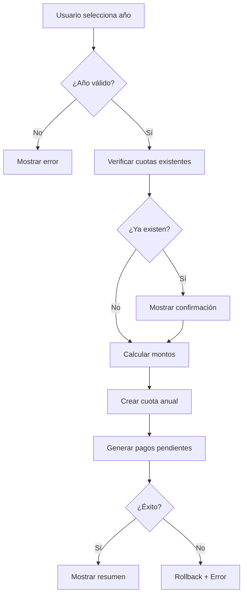

# Generación de Cuotas Anuales - Plan de Implementación

## 📋 Índice

1. [Visión General](#visión-general)
2. [Objetivos](#objetivos)
3. [Arquitectura](#arquitectura)
4. [Documentación Técnica](#documentación-técnica)
5. [Cronograma](#cronograma)
6. [Criterios de Aceptación](#criterios-de-aceptación)

---

## 🎯 Visión General

La funcionalidad de **Generación de Cuotas Anuales** permite a los administradores de ASAM crear automáticamente las cuotas de membresía anual para todos los miembros activos, tanto individuales como familiares, facilitando la migración de datos históricos desde Excel y el seguimiento de pagos futuros.

### Problema a Resolver

Actualmente, la asociación gestiona manualmente las cuotas anuales en Excel, lo que dificulta:
- El seguimiento de pagos pendientes por año
- La generación histórica de cuotas para migración de datos
- El control de morosidad por año específico
- La automatización de recordatorios de pago

### Solución Propuesta

Implementar un sistema completo de generación de cuotas que permita:
- ✅ Crear cuotas para un año específico (presente o pasado, nunca futuro)
- ✅ Calcular automáticamente el monto según el tipo de membresía
- ✅ Asociar pagos a cuotas específicas
- ✅ Visualizar el estado de pagos por año y miembro
- ✅ Generar informes de morosidad por año

---

## 🎯 Objetivos

### Funcionales
1. **Generación Masiva**: Crear cuotas para todos los miembros activos de un año específico
2. **Cálculo Automático**: Aplicar tarifas diferenciadas para familias vs individuales
3. **Migración Histórica**: Permitir generación retroactiva para años pasados
4. **Validación**: Prevenir duplicación de cuotas para el mismo año/miembro
5. **Asociación Pagos**: Vincular pagos existentes a cuotas generadas

### No Funcionales
1. **Performance**: Generación de <2s para ~200 miembros
2. **Integridad**: Transaccionalidad completa (todo o nada)
3. **Auditoría**: Log completo de generaciones
4. **Usabilidad**: Interfaz intuitiva con feedback claro

---

## 🏗️ Arquitectura

### Modelo de Datos

```
MembershipFee (Cuota Anual)
├── year: int (año de la cuota)
├── base_fee_amount: float (tarifa base)
├── family_fee_extra: float (extra para familias)
└── due_date: time (31 diciembre del año)

Payment (Pago)
├── member_id: uint (socio que paga)
├── amount: float
├── payment_date: time
├── status: enum (pending/paid/cancelled)
├── membership_fee_id: uint* (cuota asociada)
└── notes: string
```

### Flujo de Generación



---

## 📚 Documentación Técnica

La documentación completa está organizada en los siguientes archivos:

### 1. [Backend Implementation](./backend.md)
Especificación técnica detallada del backend:
- Nuevas queries y mutations GraphQL
- Servicios de dominio
- Repositorios y modelos
- Validaciones de negocio
- Ejemplos de código completos

### 2. [Frontend Implementation](./frontend.md)
Especificación técnica detallada del frontend:
- Componentes UI (React + Material-UI)
- Hooks personalizados
- Integración GraphQL
- Gestión de estado
- Validaciones de formulario
- Ejemplos de implementación

### 3. [Testing Strategy](./testing.md)
Plan de pruebas completo:
- Tests unitarios (backend y frontend)
- Tests de integración
- Tests end-to-end
- Casos de prueba específicos
- Cobertura mínima requerida

### 4. [Deployment Guide](./deployment.md)
Guía de despliegue paso a paso:
- Migraciones de base de datos
- Variables de entorno
- Rollout strategy
- Rollback plan
- Monitorización post-deploy

---

## 📅 Cronograma

### Fase 1: Backend (Estimado: 3-4 días)
- **Día 1**: Modificaciones en modelos + migraciones
- **Día 2**: Servicios de generación + validaciones
- **Día 3**: Resolvers GraphQL + tests unitarios
- **Día 4**: Tests de integración + documentación

### Fase 2: Frontend (Estimado: 3-4 días)
- **Día 1**: Componentes UI básicos
- **Día 2**: Lógica de negocio + validaciones
- **Día 3**: Integración GraphQL + estados
- **Día 4**: Refinamiento UX + tests

### Fase 3: Testing & Deploy (Estimado: 2 días)
- **Día 1**: Tests E2E + correcciones
- **Día 2**: Deploy staging + validación + production

**Tiempo Total Estimado: 8-10 días laborables**

---

## ✅ Criterios de Aceptación

### Backend
- [ ] Se pueden generar cuotas para cualquier año ≤ año actual
- [ ] Se previene generación duplicada para mismo año
- [ ] Se calculan correctamente montos para familias vs individuales
- [ ] Se crean registros de Payment con status PENDING
- [ ] Se mantiene integridad transaccional
- [ ] Cobertura de tests ≥ 80%

### Frontend
- [ ] Interfaz permite seleccionar año y monto base
- [ ] Validación previene años futuros
- [ ] Muestra preview antes de confirmar
- [ ] Feedback claro en éxito/error
- [ ] Loading states apropiados
- [ ] Responsive en mobile

### Integración
- [ ] Flujo completo funciona sin errores
- [ ] Generación de ~200 cuotas < 2 segundos
- [ ] Rollback funciona correctamente
- [ ] Logs de auditoría completos
- [ ] Sin memory leaks ni race conditions

### Migración Histórica
- [ ] Se pueden crear cuotas para años pasados (ej: 2020-2024)
- [ ] Pagos históricos se asocian correctamente
- [ ] No afecta cuotas/pagos existentes
- [ ] Data consistency al 100%

---

## 📖 Convenciones

### Commits
```
feat(fees): add annual fee generation service
fix(fees): prevent duplicate fee creation
test(fees): add integration tests for fee generation
docs(fees): update fee generation documentation
```

### Branches
```
feature/annual-fee-generation-backend
feature/annual-fee-generation-frontend
```

### Pull Requests
- Título: `[FEAT] Annual Fee Generation - <componente>`
- Descripción: Link a esta documentación + checklist
- Revisores: Mínimo 1 revisor técnico
- Tests: Todos los tests deben pasar

---

## 🚀 Quick Start

### Para Backend Developer
```bash
# 1. Leer documentación
cat docs/annual_fee_generation/backend.md

# 2. Crear rama
git checkout -b feature/annual-fee-generation-backend

# 3. Seguir pasos en backend.md
# ...
```

### Para Frontend Developer
```bash
# 1. Leer documentación
cat docs/annual_fee_generation/frontend.md

# 2. Crear rama
git checkout -b feature/annual-fee-generation-frontend

# 3. Seguir pasos en frontend.md
# ...
```

---

## 📞 Contacto y Soporte

Para dudas o clarificaciones sobre esta funcionalidad:
- **Tech Lead**: Javier Fernández
- **Docs**: Este repositorio `/docs/annual_fee_generation/`
- **Issues**: GitHub Issues con tag `annual-fees`

---

## 📝 Changelog

| Versión | Fecha | Descripción |
|---------|-------|-------------|
| 1.0.0   | 2025-11-07 | Documentación inicial |

---

## 🔗 Referencias

- [Domain Model](../../internal/domain/models/)
- [GraphQL Schema](../../internal/adapters/gql/schema/)
- [Payment Service](../../internal/domain/services/payment_service.go)
- [Frontend Payments Feature](../../../src/features/payments/)

---

**Última actualización**: 7 de noviembre de 2025  
**Estado**: 📝 Documentación Completa - Pendiente de Implementación
